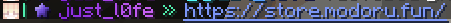
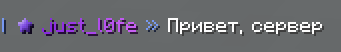

# Чат

Наш чат, это отдельный самописный плагин, который всегда обновляется и имеет множество уникальных фишек.

## Упоминания

Упоминания, очень схожи с тем, как это работает в приложении Discord. Упоминания бывают двух видов: **@everyone**(всех игроков онлайн) или **@ник**(одного игрока):


> Личные упоминания отображаются только у игрока, которого упомянули. 

::: info
Оба типа упоминаний сопровождаются звуком и Push-UP уведомлением. Могут быть отключены в настройках.
:::

## Ссылки

В чате присутствует простая передача ссылок, для того чтобы игроки могли просто обмениваться интернет ресурсами. Ссылку можно отправить так-же двумя способами:


> Исходное сообщение: !https://store.modoru.fun/


> Исходное сообщение: ````
Формат: ``[Текст](Ссылка)``

## Эмодзи

Пользоваться эмодзи достаточно просто. Для этого, отделите место для эмодзи пробелом, и напишите двоеточие. Нажав клавишу [TAB], вам автоматически подскажут какие эмодзи есть на сервере.


> Эмодзи в примере: ``:smiling:`` ``:angel:`` ``:wink:`` ``:concerned:``

## Форматирование текста

С старых времён, в майнкрафте существует функция форматирования текста. НО, дабы не засорять чат, мы урезали её, и существует всего 4 вида форматирования:
- жирный ``&l``
- подчёркнутый ``&n``
- зачёркнутый ``&m``
- сброс форматирования ``&r``


> Текст в примере: ``!&lжирный&r, &nподчёркнутый&r, &mзачёркнутый&r``
::: info
Эта функция доступна исключительно для владельцев подписок [SUB][sub] или [SUB+][sub]
:::

## Местоположение

Срочно нужно поделиться координатами? Эта функция идеально подойдёт для этого. Также изменяется цвет сообщения в зависимости от измерения в котором была прописана команда.
Что-бы отправить свои координаты в чат, достаточно написать ``&loc``.


> Текст в примере: ``!Мои координаты: &loc``

---

# Группы

заготовка

---

# Связь с дискордом
Когда вы впервые заходили на сервер, вы привязывали свой аккаунт в игре к аккаунту в дискорде. Благодаря этому, в дискорде существует отдельный, [серверный чат][DCchat]. В нём синхронизирован игровой глобальный чат:


> Сообщение из глобального чата майнкрафта, в дискорде


> Сообщение из дискорда, в майнкрафте

[sub]: ../main/subscriptions.md
[DCchat]: https://discord.com/channels/652175216390176787/879758494042042428