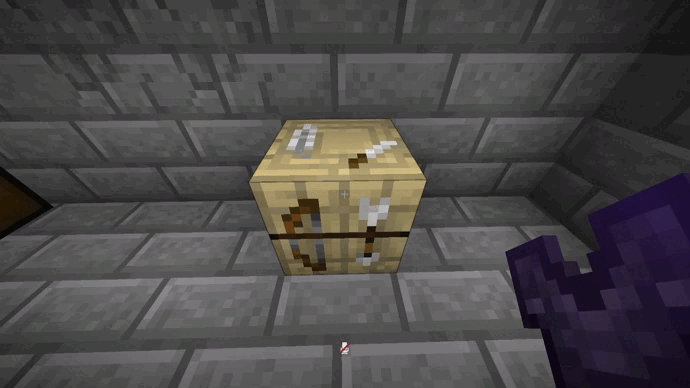
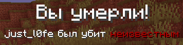

# Редактирование невидимого света

Очень полезная механика для строителей. Позволяет изменить уровень света излучаемого от невидимого источника света, тем самым расширяя сферы применения.  Для редактирования света достаточно нажать Shift + F держа свет в ведущей руке, и крутить колесико мыши в зависимости от нужного вам уровня.

[Пример](https://youtu.be/MT6xE1CZoEU?si=Tlyct8MSt2Y2RSwK)

---

# Подпись предметов

Подпись предметов - достаточно полезная механика, когда требуется доказать кражу или к примеру распространить товар. Что-бы подписать предмет, нужно: Поместить в вторую руку чернильный мешок и нажать \[ПКМ] с предметом в руке который требуется подписать, по столу лучника.

::: info
Функция доступна только подписчикам [SUB][sub] или [SUB+][sub]!
:::
---

# Снежки

Нажав пустой рукой на сугроб, [ПКМ] с зажатым шифтом, вы слепите снежок в количество от 1 до 3 штук.

---

# Быстрый сбор культур

Нажав пустой рукой на культуру [ПКМ] вам выпадет культура, и автоматически начнёт расти.

---

# Убийство в невидимости

Убив игрока в невидимости, в чате, не отобразиться ник убийцы, вместо этого будет отображено:

---

# Выпадение тотемов бессмертия
Шанс выпадения тотемов бессмертия урезан до 2%, дабы увеличить их ценность. Шанс распространяется только на мобов-участников рейда.

---

# Выпадение проворства с Хранителя

Добавлена возможность выбить зачарованную книгу Проворство с Хранителя. Уровень зачарованные книги от 1 до 3.

***Шансы выпадения:***

| Зачарование | Шанс|
|---------|----------|
| Проворство I | ~25%|
| Проворство II | ~11%|
| Проворство III | ~10%|

[sub]: ../main/subscriptions.md